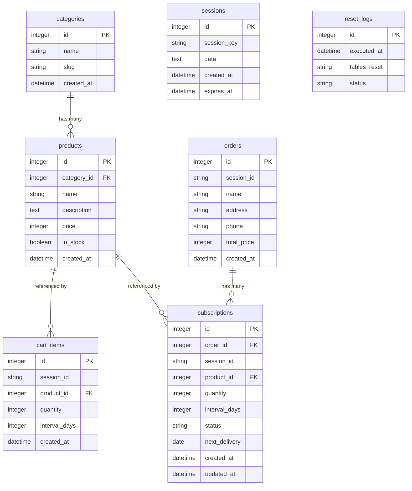

# ER 図（デモ版）

最終更新: 2026-05-30

> **エディション**: デモ版（SQLite）
> 認証なし・セッションベース。マスタテーブルはリセット対象外。

---

---

## テーブル定義

| テーブル | 初期件数 | リセット対象 | 備考 |
|---------|---------|------------|------|
| `categories` | 4件（固定） | 非対象 | マスタ |
| `products` | 12件（固定） | 非対象 | マスタ（在庫なし 1件含む） |
| `sessions` | 動的 | 対象 | Cookie session_key で識別 |
| `cart_items` | 動的 | 対象 | session_id で分離 |
| `orders` | 動的 | 対象 | session_id で分離 |
| `subscriptions` | 動的 | 対象 | status: active / paused / cancelled |
| `reset_logs` | 累積 | 非対象 | リセット実行ログ |

## バリデーション

| フィールド | ルール |
|-----------|--------|
| `cart_items.quantity` | 1〜5（整数） |
| `cart_items.interval_days` | 14 / 30 / 60 のいずれか |
| `orders.name` | 1〜100 文字 |
| `orders.address` | 1〜255 文字 |
| `orders.phone` | 数字のみ・10〜11 桁 |
| `subscriptions.status` | active → paused → active / cancelled |
