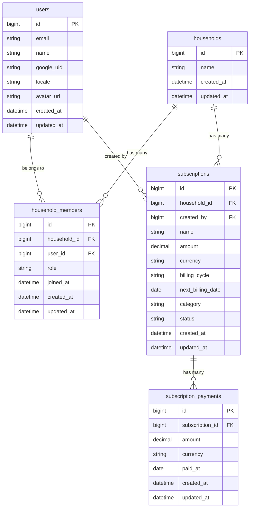

# ER 図

最終更新: 2026-05-30

```mermaid
erDiagram
    users {
        bigint id PK
        string email
        string name
        string google_uid
        string locale
        string avatar_url
        datetime created_at
        datetime updated_at
    }

    households {
        bigint id PK
        string name
        datetime created_at
        datetime updated_at
    }

    household_members {
        bigint id PK
        bigint household_id FK
        bigint user_id FK
        string role
        datetime joined_at
        datetime created_at
        datetime updated_at
    }

    subscriptions {
        bigint id PK
        bigint household_id FK
        bigint created_by FK
        string name
        decimal amount
        string currency
        string billing_cycle
        date next_billing_date
        string category
        string status
        datetime created_at
        datetime updated_at
    }

    subscription_payments {
        bigint id PK
        bigint subscription_id FK
        decimal amount
        string currency
        date paid_at
        datetime created_at
        datetime updated_at
    }

    users ||--o{ household_members : "belongs to"
    households ||--o{ household_members : "has many"
    households ||--o{ subscriptions : "has many"
    users ||--o{ subscriptions : "created by"
    subscriptions ||--o{ subscription_payments : "has many"
```
