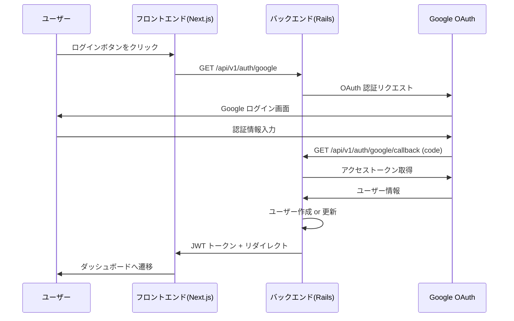
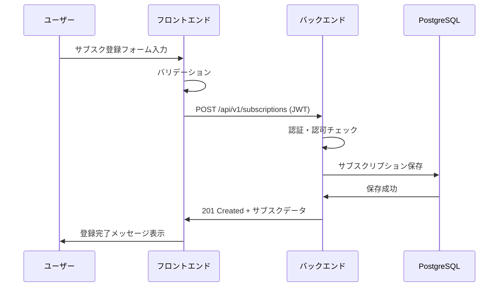

# シーケンス図

最終更新: 2026-05-30

---

## Google OAuth ログインフロー

```mermaid
sequenceDiagram
    participant U as ユーザー
    participant FE as フロントエンド(Next.js)
    participant BE as バックエンド(Rails)
    participant G as Google OAuth

    U->>FE: ログインボタンをクリック
    FE->>BE: GET /api/v1/auth/google
    BE->>G: OAuth 認証リクエスト
    G->>U: Google ログイン画面
    U->>G: 認証情報入力
    G->>BE: GET /api/v1/auth/google/callback (code)
    BE->>G: アクセストークン取得
    G->>BE: ユーザー情報
    BE->>BE: ユーザー作成 or 更新
    BE->>FE: JWT トークン + リダイレクト
    FE->>U: ダッシュボードへ遷移
```

---

## サブスクリプション登録フロー

```mermaid
sequenceDiagram
    participant U as ユーザー
    participant FE as フロントエンド
    participant BE as バックエンド
    participant DB as PostgreSQL

    U->>FE: サブスク登録フォーム入力
    FE->>FE: バリデーション
    FE->>BE: POST /api/v1/subscriptions (JWT)
    BE->>BE: 認証・認可チェック
    BE->>DB: サブスクリプション保存
    DB->>BE: 保存成功
    BE->>FE: 201 Created + サブスクデータ
    FE->>U: 登録完了メッセージ表示
```
