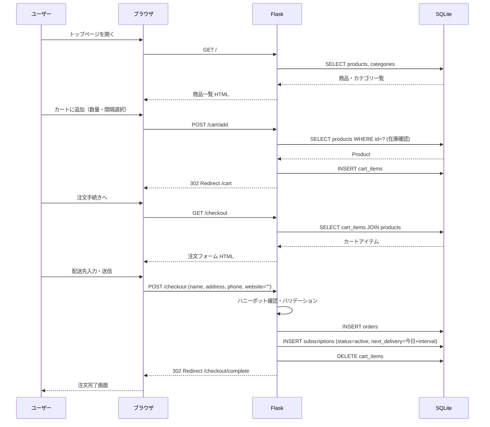
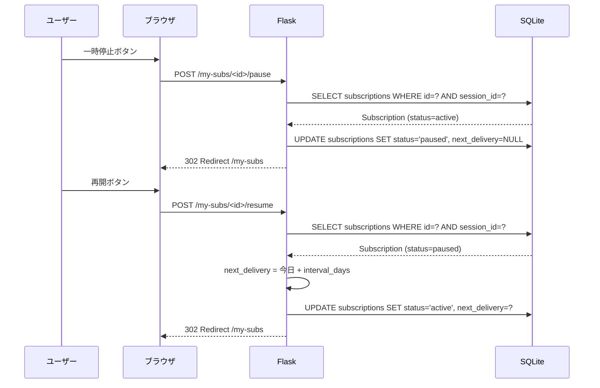
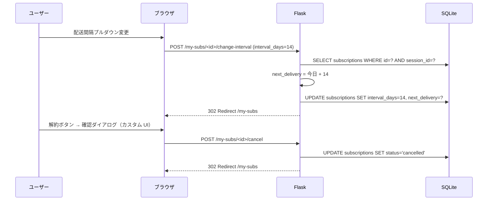
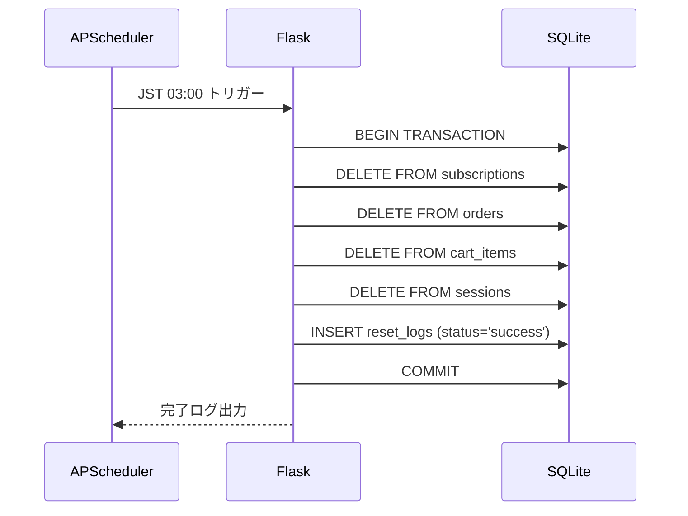
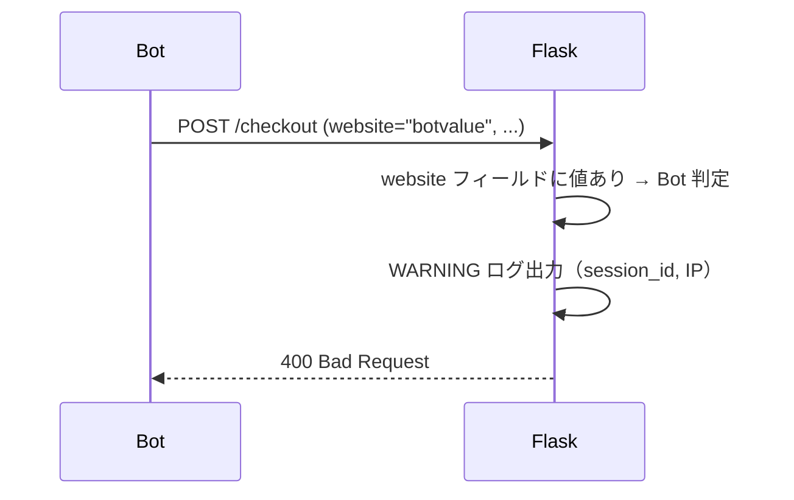

# シーケンス図（デモ版）

最終更新: 2026-05-30

> **エディション**: デモ版（Flask + SQLite・セッションベース・認証なし）

---

## 商品選択〜注文確定

```mermaid
sequenceDiagram
    participant U  as ユーザー
    participant BR as ブラウザ
    participant FL as Flask
    participant DB as SQLite

    U->>BR: トップページを開く
    BR->>FL: GET /
    FL->>DB: SELECT products, categories
    DB-->>FL: 商品・カテゴリ一覧
    FL-->>BR: 商品一覧 HTML

    U->>BR: カートに追加（数量・間隔選択）
    BR->>FL: POST /cart/add
    FL->>DB: SELECT products WHERE id=? (在庫確認)
    DB-->>FL: Product
    FL->>DB: INSERT cart_items
    FL-->>BR: 302 Redirect /cart

    U->>BR: 注文手続きへ
    BR->>FL: GET /checkout
    FL->>DB: SELECT cart_items JOIN products
    DB-->>FL: カートアイテム
    FL-->>BR: 注文フォーム HTML

    U->>BR: 配送先入力・送信
    BR->>FL: POST /checkout (name, address, phone, website="")
    FL->>FL: ハニーポット確認・バリデーション
    FL->>DB: INSERT orders
    FL->>DB: INSERT subscriptions (status=active, next_delivery=今日+interval)
    FL->>DB: DELETE cart_items
    FL-->>BR: 302 Redirect /checkout/complete
    BR-->>U: 注文完了画面
```

---

## サブスク一時停止〜再開

```mermaid
sequenceDiagram
    participant U  as ユーザー
    participant BR as ブラウザ
    participant FL as Flask
    participant DB as SQLite

    U->>BR: 一時停止ボタン
    BR->>FL: POST /my-subs/<id>/pause
    FL->>DB: SELECT subscriptions WHERE id=? AND session_id=?
    DB-->>FL: Subscription (status=active)
    FL->>DB: UPDATE subscriptions SET status='paused', next_delivery=NULL
    FL-->>BR: 302 Redirect /my-subs

    U->>BR: 再開ボタン
    BR->>FL: POST /my-subs/<id>/resume
    FL->>DB: SELECT subscriptions WHERE id=? AND session_id=?
    DB-->>FL: Subscription (status=paused)
    FL->>FL: next_delivery = 今日 + interval_days
    FL->>DB: UPDATE subscriptions SET status='active', next_delivery=?
    FL-->>BR: 302 Redirect /my-subs
```

---

## 配送間隔変更・解約

```mermaid
sequenceDiagram
    participant U  as ユーザー
    participant BR as ブラウザ
    participant FL as Flask
    participant DB as SQLite

    U->>BR: 配送間隔プルダウン変更
    BR->>FL: POST /my-subs/<id>/change-interval (interval_days=14)
    FL->>DB: SELECT subscriptions WHERE id=? AND session_id=?
    FL->>FL: next_delivery = 今日 + 14
    FL->>DB: UPDATE subscriptions SET interval_days=14, next_delivery=?
    FL-->>BR: 302 Redirect /my-subs

    U->>BR: 解約ボタン → 確認ダイアログ（カスタム UI）
    BR->>FL: POST /my-subs/<id>/cancel
    FL->>DB: UPDATE subscriptions SET status='cancelled'
    FL-->>BR: 302 Redirect /my-subs
```

---

## DBデイリーリセット（APScheduler）

```mermaid
sequenceDiagram
    participant SC as APScheduler
    participant FL as Flask
    participant DB as SQLite

    SC->>FL: JST 03:00 トリガー
    FL->>DB: BEGIN TRANSACTION
    FL->>DB: DELETE FROM subscriptions
    FL->>DB: DELETE FROM orders
    FL->>DB: DELETE FROM cart_items
    FL->>DB: DELETE FROM sessions
    FL->>DB: INSERT reset_logs (status='success')
    FL->>DB: COMMIT
    FL-->>SC: 完了ログ出力
```

---

## ハニーポット検知

```mermaid
sequenceDiagram
    participant B  as Bot
    participant FL as Flask

    B->>FL: POST /checkout (website="botvalue", ...)
    FL->>FL: website フィールドに値あり → Bot 判定
    FL->>FL: WARNING ログ出力（session_id, IP）
    FL-->>B: 400 Bad Request
```
